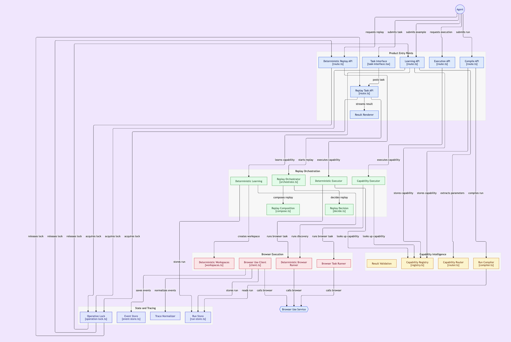

# Replay
Replay turns browser-agent exploration into reusable deterministic workflows.
An agent completes a task once, Replay records what it learned, then future runs can execute the same workflow with **0 AI calls, 0 tokens, and 0 inference cost**.
Built at the General Catalyst Hackathon in Waterloo.

## Demo
https://replay-general-catalyst-hackathon.vercel.app/

## System

## Stack
Next.js, TypeScript, Browser Use, Browserbase, Stagehand, SSE
